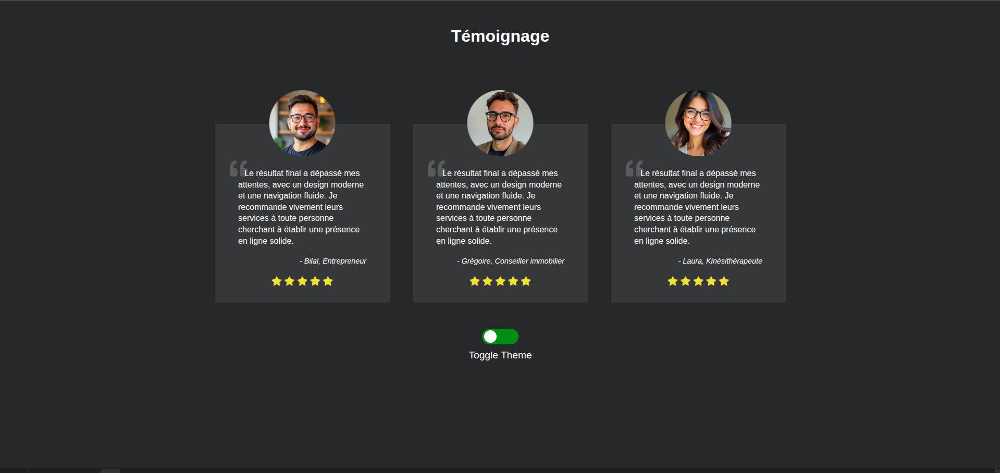

# 🧩 Maquette Témoignages  

Cet exercice avait pour objectif de **réviser les bases du HTML et du CSS** à travers la création d'une petite maquette de cartes de témoignages.

---

## 🎯 Objectifs du projet  

- Intégration de **trois cartes responsives** en utilisant **Flexbox**, sans recourir aux *media queries*.  
- Utilisation des **pseudo-éléments `::before` et `::after`** pour insérer l’icône *quote-left* sans alourdir le DOM.  
- Respect maximal de la **sémantique HTML**.  
- Ajout d’une partie **JavaScript** permettant de basculer entre le **thème clair et sombre**, en modifiant dynamiquement les **variables CSS**.  

---

## 🧠 Compétences mises en pratique  

- Mise en page responsive avec **Flexbox**.  
- Gestion du contenu décoratif via les **pseudo-éléments CSS**.  
- Respect des **bonnes pratiques de sémantique HTML**.  
- Manipulation du **DOM** et des **Custom Properties CSS** avec JavaScript.  

---

## 🛠️ Technologies utilisées  

| Technologie | Description |
|--------------|-------------|
| 🧱 **HTML5** | Structure sémantique du contenu |
| 🎨 **CSS3 (Flexbox, Variables, Pseudo-éléments)** | Mise en page et design responsive |
| ⚙️ **JavaScript** | Gestion du switch de thème (Light/Dark) |

---

## 📸 Aperçu  

*(Ajoute ici une capture d’écran du rendu si tu en as une, par exemple :)*  

